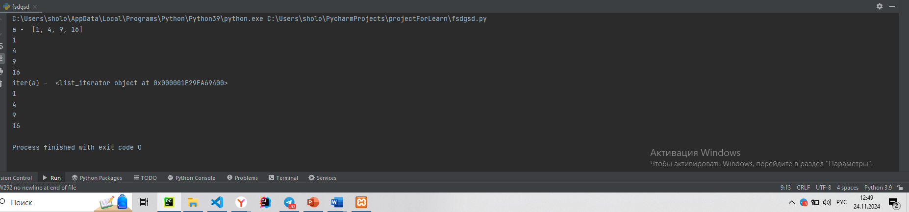

# Тема 11. Итераторы и генераторы
Отчет по Теме #11 выполнил:
- Мамедов Роял Мубаризович
- ПИЭ-22-1

| Задание    | Лаб_раб | Сам_раб |
|------------|---------|---------|
| Задание 1  | +       | +       |
| Задание 2  | +       | +       |
| Задание 3  | +       | -       |
| Задание 4  | +       | -       |
| Задание 5  | +       | -       |


знак "+" - задание выполнено; знак "-" - задание не выполнено;

Работу проверили:
- к.э.н., доцент Панов М.А.

#1

```python
numbers = [0, 1, 2, 3, 4, 5]
for item in numbers:
    print(item)
```
### Результат.


### Выводы
При помощи итератора считает числа фибоначчи


#2

```python
class CountDown:
    def __init__(self, start):
        self.count = start + 1

    def __iter__(self):
        return self

    def __next__(self):
        self.count -= 1
        if self.count < 0:
            raise StopIteration
        return self.count

counter = CountDown(5)
for i in counter:
    print(i)
```
### Результат.


### Выводы 
Реальизован класс счетчик 

#3

```python
a = [i ** 2 for i in range(1, 5)]

print('a - ', a)
for i in a:
    print(i)

print('iter(a) - ', iter(a))
for i in a:
    print(i)

```
### Результат.



### Выводы 
генерирует список
  
#4


```python
b = (i ** 2 for i in range(1, 5))
print(b)
print('first')
for i in b:
    print(i)
print('second')

for i in b:
    print(i)
```
### Результат.


### Выводы
генерирует кортеж

#5


```python
def countdown(count):
    while count >= 0:
        yield count
        count -= 1

counter = countdown(5)
for i in counter:
    print(i)

```
### Результат.


### Выводы
Применили такое ключевое слово как yield

## Самостоятельная работа №10
#1

```python
def fib(n):
    a, b = 1, 1
    for num in range(n):
        yield a
        a, b = b, a + b

n = 255
fibonacci_numbers = list(fib(n))

print(f"{n}-е число Фибоначчи: {fibonacci_numbers[-1]}")
```
### Результат.


### Выводы
Создали функцию которая при помощи генератора создает список чисел фибоначчи

#2

```python
def fib(n):
    a, b = 1, 1
    with open('fib.txt', 'w') as f:
        for _ in range(n):
            f.write(f"{a}\n")
            yield a
            a, b = b, a + b

n = 255
fibonacci_numbers = list(fib(n))

print(f"{n}-е число Фибоначчи: {fibonacci_numbers[-1]}")
```
### Результат.


### Выводы
Так же с помощью генератора получаем числа фибоначчи но сохраняем их в файле

## Общие выводы по теме
Познакомился с генераторами и как они работают
