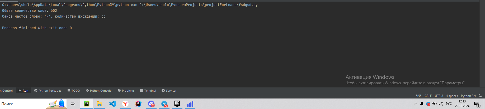
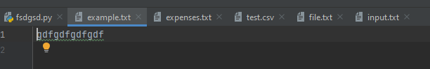

# Тема 7. Работа с файлами (ввод и вывод)
Отчет по Теме #7 выполнил:
- Мамедов Роял Мубаризович
- ПИЭ-22-1

| Задание    | Лаб_раб | Сам_раб |
|------------|---------|---------|
| Задание 1  | +       | +       |
| Задание 2  | +       | +       |
| Задание 3  | +       | +       |
| Задание 4  | +       | +       |
| Задание 5  | +       | +       |
| Задание 6  | +       | -       |
| Задание 7  | +       | -       |
| Задание 8  | +       | -       |
| Задание 9  | +       | -       |
| Задание 10 | +       | -       |

знак "+" - задание выполнено; знак "-" - задание не выполнено;

Работу проверили:
- к.э.н., доцент Панов М.А.

#1

```python

```
### Результат.


#2

```python
f = open('file.txt', 'r')
print(f.readline())
f.close()
```
### Результат.


#3

```python
f = open('file.txt', 'r')
print(f.readlines())
f.close()
```
### Результат.


  
#4


```python
with open('file.txt') as f:
    print(f.readlines())
```
### Результат.


#5


```python
with open('file.txt') as f:
    for line in f:
        print(line)
```
### Результат.


#6


```python
with open('input.txt', 'a+') as f:
    f.write('\nIm additional line')

with open('input.txt', 'r') as f:
    result = f.readlines()
    print(result)
```
### Результат.


#7


```python
lines = ['one', 'two', 'three']
with open('file.txt', 'w') as f:
    for line in lines:
        f.write('\nCycle run ' + line)
    print('Done!')
```
### Результат.


#8


```python
import os

def print_docs(directory):
    all_files = os.walk(directory)
    for catalog in all_files:
        print(f'Папка {catalog[0]} содержит:')
    print(f'Директории: {", ".join([folder for folder in catalog[1]])}')
    print(f'Файлы: {", ".join([file for file in catalog[2]])}')
    print('-' * 48)

print_docs('C:/Users/sholo/PycharmProjects/projectForLearn')
```
### Результат.


#9


```python
def longest_words(file):
    with open(file, encoding='utf-8') as f:
        words = f.read().split()
        max_length = len(max(words, key=len))
        for word in words:
            if len(word) == max_length:
                sought_words = word

        if len(sought_words) == 1:
            return sought_words[0]
        return sought_words

print(longest_words('input.txt'))
```
### Результат.


#10

```python
import csv
import datetime
import time

with open('test.csv', 'w', encoding='utf-8', newline='') as f:
    writer = csv.writer(f)
    writer.writerow(['№', 'Секунда', 'Микросекунда'])
    for line in range(1, 301):
        writer.writerow([line, datetime.datetime.now().second,
                         datetime.datetime.now().microsecond])
        time.sleep(0.01)
```
### Результат.


## Самостоятельная работа №7
#1

```python
from collections import Counter
import re

def count_words_in_file(filename):
    with open(filename, 'r', encoding='utf-8') as file:
        text = file.read().lower()
        words = re.findall(r'\b\w+\b', text)
        word_count = Counter(words)
        most_common_word = word_count.most_common(1)[0]
    return len(words), most_common_word

total_words, most_common_word = count_words_in_file("file.txt")
print(f"Общее количество слов: {total_words}")
print(f"Самое частое слово: '{most_common_word[0]}', количество вхождений: {most_common_word[1]}")
```
### Результат.




### Выводы

`text = file.read().lower()` Читаем файл и приводим текст к нижнему регистру `words = re.findall(r'\b\w+\b', text)` Используем регулярное выражение для поиска слов
`word_count = Counter(words)` Подсчитываем количество вхождений каждого слова `most_common_word = word_count.most_common(1)[0]` Находим самое частое слово
  
#2

```python
def add_expense(filename):
    with open(filename, 'a', encoding='utf-8') as file:
        expense = input("Введите описание расхода и сумму: ")
        file.write(expense + "\n")

def show_expenses(filename):
    with open(filename, 'r', encoding='utf-8') as file:
        expenses = file.readlines()
        if expenses:
            print("Ваши расходы:")
            for expense in expenses:
                print(expense.strip())
        else:
            print("Расходов нет.")

add_expense("expenses.txt")
add_expense("expenses.txt")
add_expense("expenses.txt")
show_expenses("expenses.txt")
```
### Результат.


### Выводы

`file.write(expense + "\n")` Записываем строку в файл`print(expense.strip())` Выводим каждую строку
  
#3

```python
import re

def text_statistics(filename):
    with open(filename, 'r', encoding='utf-8') as file:
        lines = file.readlines()
        num_lines = len(lines)
        num_words = 0
        num_letters = 0

        for line in lines:
            words = line.split()
            num_words += len(words)
            num_letters += len(re.findall(r'[a-zA-Z]', line))

        print(f"{num_letters} letters")
        print(f"{num_words} words")
        print(f"{num_lines} lines")

text_statistics("input.txt")
```
### Результат.


### Выводы

`lines = file.readlines()` Читаем все строки файла`words = line.split()` Разбиваем строку на слова
`num_words += len(words)` Считаем слова `num_letters += len(re.findall(r'[a-zA-Z]', line))` Используем регулярное выражение для поиска латинских букв
  
#4


```python
import re

def load_forbidden_words(filename):
    with open(filename, 'r', encoding='utf-8') as file:
        forbidden_words = file.read().split()
    return forbidden_words

def censor_sentence(sentence, forbidden_words):
    for word in forbidden_words:
        pattern = re.compile(re.escape(word), re.IGNORECASE)
        sentence = pattern.sub('*' * len(word), sentence)
    return sentence

forbidden_words = load_forbidden_words("input.txt")

sentence = input("Введите предложение для проверки: ")

censored_sentence = censor_sentence(sentence, forbidden_words)

print("Результат:", censored_sentence)
```
### Результат.


### Выводы

`forbidden_words = file.read().split()` Чтение и разбиение строки на слова `pattern = re.compile(re.escape(word), re.IGNORECASE)` Создаем регулярное выражение для поиска запрещенных слов независимо от регистра
`sentence = pattern.sub('*' * len(word), sentence)` Замена на звездочки `forbidden_words = load_forbidden_words("input.txt")` Чтение списка запрещённых слов из файла
  
#5

```python
def read_file(file_name):
    try:
        with open(file_name, 'r') as file:
            content = file.readlines()
            print("Содержимое файла:")
            for line in content:
                print(line.strip())
            return content
    except FileNotFoundError:
        print(f"Файл {file_name} не найден.")
        return []

def write_file(file_name, new_content):
    with open(file_name, 'a') as file:
        file.write(new_content + '\n')
        print(f'Добавлена строка: "{new_content}"')

def main():
    file_name = 'example.txt'


    content = read_file(file_name)

    new_content = input("Введите строку, которую хотите добавить в файл: ")
    write_file(file_name, new_content)

    print("\nОбновленное содержимое файла:")
    read_file(file_name)

if __name__ == "__main__":
    main()
```

### Результат.




### Выводы
в данном коде, мы считываем при помощи функции read file текст, и записываем в файл, а при помощи write file выводим в консоль обратно

## Общие выводы по теме
Базово освоил работу с файлами в питоне
