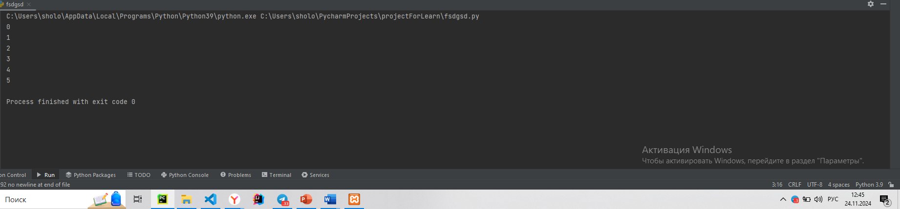
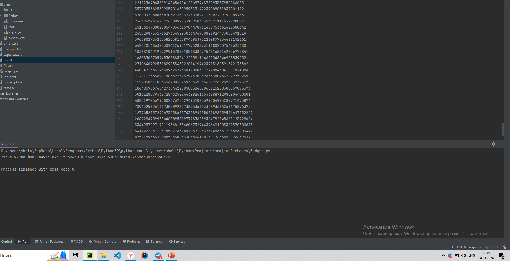
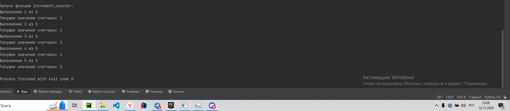
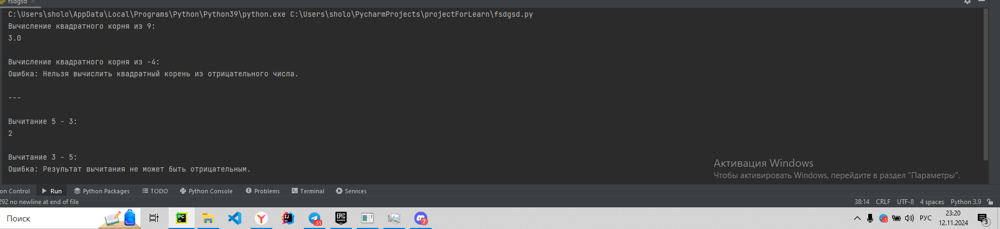

# Тема8. Ввдение в ООП
Отчет по Теме #8 выполнил:
- Мамедов Роял Мубаризович
- ПИЭ-22-1

| Задание    | Лаб_раб | Сам_раб |
|------------|---------|---------|
| Задание 1  | +       | +       |
| Задание 2  | +       | +       |
| Задание 3  | +       | +       |
| Задание 4  | +       | +       |
| Задание 5  | +       | +       |


знак "+" - задание выполнено; знак "-" - задание не выполнено;

Работу проверили:
- к.э.н., доцент Панов М.А.

#1

```python
class Car:
    def __init__(self, make, model):
        self.make = make
        self.model = model

my_car = Car("Toyota", "Corolla")
```
### Результат.



### Выводы
Создается класс машины  у которых есть переменные make model


#2

```python
class Car:
    def __init__(self, make, model):
        self.make = make
        self.model = model

    def drive(self):
        print(f"Driving the {self.make} {self.model}")

my_car = Car("Toyota", "Corolla")
my_car.drive()
```
### Результат.


### Выводы 

В предыдущий класс добавился метод drive который выводит ф строку


#3

```python
class Car:
    def __init__(self, make, model):
        self.make = make
        self.model = model

    def drive(self):
        print(f"Driving the {self.make} {self.model}")

class ElectricCar(Car):
    def __init__(self, make, model, battery_capacity):
        super().__init__(make, model)
        self.battery_capacity = battery_capacity

    def charge(self):
        print(f"Charging the {self.make} {self.model} with {self.battery_capacity} kWh")

my_electric_car = ElectricCar("Tesla", "Model S", 75)
my_electric_car.drive()
my_electric_car.charge()
```
### Результат.


### Выводы 
Добавился класс наследник электромашины, который переопределил метод charge
  
#4


```python
class Car:
    def __init__(self, make, model):
        self._make = make
        self.__model = model

    def drive(self):
        print(f"Driving the {self._make} {self.__model}")

my_car = Car("Toyota", "Corolla")

print(my_car._make)
my_car.drive()
```
### Результат.


#5


```python
class Shape:
    def area(self):
        pass

class Rectangle(Shape):
    def __init__(self, width, height):
        self.width = width
        self.height = height

    def area(self):
        return self.width * self.height

class Circle(Shape):
    def __init__(self, radius):
        self.radius = radius

    def area(self):
        return 3.14 * self.radius * self.radius

my_rectangle = Rectangle(5, 4)
my_circle = Circle(5)

print(my_rectangle.area())
print(my_circle.area())

```
### Результат.


### Выводы

Создается интерфейс фигура которого реализуют и переопределяют методы , классы круг и прямоугольник


## Самостоятельная работа №8
#1

```python
class Animal:
    def __init__(self, hp):
        self.hp = hp

    def get_hp(self):
        return self.hp

my_animal = Animal(5)
print(my_animal.get_hp())
```
### Результат.


### Выводы

Создается класс животные у которые есть жизнь, через геттер можно получить количество здоровья у них


  
#2

```python
class Animal:
    def __init__(self, hp, voice):
        self.hp = hp
        self.voice = voice

    def get_hp(self):
        return self.hp

    def say(self):
        return self.voice

my_animal = Animal(5, "я животное")
print(my_animal.get_hp())
print(my_animal.say())
```
### Результат.




### Выводы
Создается класс животные, у которого есть звук и жизнь, так же есть метод произнесения звука.

  
#3

```python
class Animal:
    def __init__(self, hp):
        self.hp = hp
        self.voice = "я животное"

    def get_hp(self):
        return self.hp

    def say(self):
        return self.voice

class Dog(Animal):
    def __init__(self, hp):
        super().__init__(hp)
        self.voice = "гав!"

my_animal = Animal(5)
my_dog= Dog(10)

print(my_animal.say())
print(my_dog.say())
```
### Результат.


### Выводы

Создается так же класс животные и наследник класс собака который переопределил метод
  
#4


```python
class Animal:
    def __init__(self, hp):
        self.__hp = hp  
        self.voice = "я животное"

    def get_hp(self):
        return self.__hp

    def set_hp(self, new_hp):
        if new_hp >= 0:  
            self.__hp = new_hp
        else:
            print("Значение здоровья не может быть отрицательным")

    def say(self):
        return self.voice

class Dog(Animal):
    def __init__(self, hp):
        super().__init__(hp)
        self.voice = "гав!"

my_animal = Animal(5)
my_dog = Dog(10)

print(my_animal.say())  
print(my_dog.say())      

print(my_animal.get_hp())  
my_animal.set_hp(8)       
print(my_animal.get_hp())  
my_animal.set_hp(-3)
```
### Результат.



### Выводы
Добавлена инкапсуляция геттеры и сеттеры для получения и выставления параметров для классов

  
#5

```python
class Animal:
    def __init__(self, hp):
        self.__hp = hp  

    def get_hp(self):
        return self.__hp

    def set_hp(self, new_hp):
        if new_hp >= 0:
            self.__hp = new_hp
        else:
            print("Значение здоровья не может быть отрицательным")

    def say(self):
        return "я животное" 


class Dog(Animal):
    def __init__(self, hp):
        super().__init__(hp)

    def say(self):
        return "гав!"  


class Cat(Animal):
    def __init__(self, hp):
        super().__init__(hp)

    def say(self):
        return "мяу!"  

animals = [Animal(5), Dog(10), Cat(8)]

for animal in animals:
    print(animal.say())  
```

### Результат.




### Выводы
Создали полиморфизм чтобы вызвать разные классы реализующие по разному основной класс
## Общие выводы по теме
Работа с ООП в питоне, такие принципы ООП как инкапсуляция и наследование, полиморфизм.
