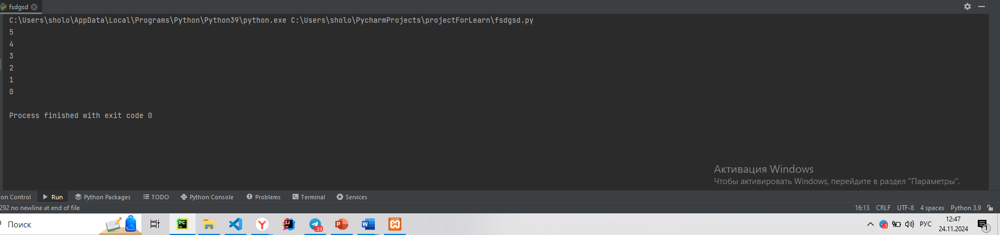
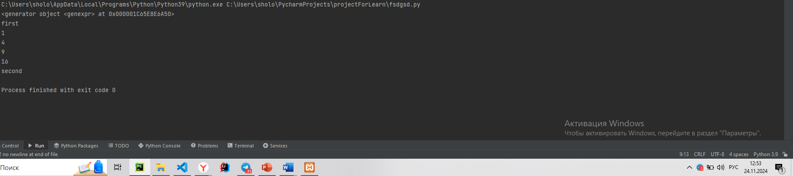
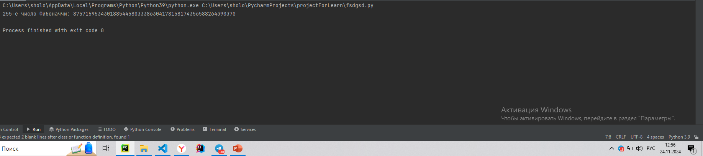
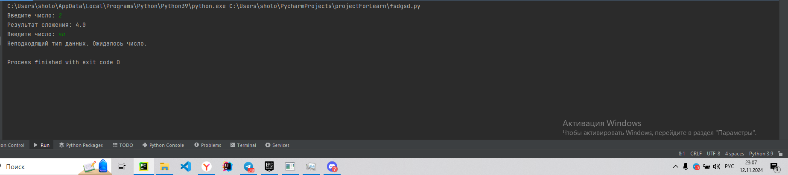

# Тема 9. ООП на Python: концепции, принципы и примеры реализации
Отчет по Теме #9 выполнил:
- Мамедов Роял Мубаризович
- ПИЭ-22-1

| Задание    | Лаб_раб | Сам_раб |
|------------|---------|---------|
| Задание 1  | +       | +       |
| Задание 2  | +       | +       |
| Задание 3  | +       | +       |
| Задание 4  | +       | +       |
| Задание 5  | +       | +       |
| Задание 6  | -       | +       |
| Задание 7  | -       | -       |
| Задание 8  | -       | -       |
| Задание 9  | -       | -       |
| Задание 10 | -       | -       |


знак "+" - задание выполнено; знак "-" - задание не выполнено;

Работу проверили:
- к.э.н., доцент Панов М.А.

#1

```python
class Ivan:
    __slots__ = ['name']

    def __init__(self, name):
        if name == 'Иван':
            self.name = f"Да, я {name}"
        else:
            self.name = f"Я не {name}, а Иван"

person1 = Ivan('Алексей')
person2 = Ivan('Иван')
print(person1.name)
print(person2.name)
```
### Результат.


### Выводы
Класс Иван проверящий при создании экземпляра класса введенное имя


#2

```python
class Icecream:
    def __init__(self, ingredient=None):
        if isinstance(ingredient, str):
            self.ingredient = ingredient
        else:
            self.ingredient = None

    def composition(self):
        if self.ingredient:
            print(f"Мороженое с {self.ingredient}")
        else:
            print("Обычное мороженое")

icecream = Icecream()
icecream.composition()
icecream = Icecream('шоколадом')
icecream.composition()
icecream = Icecream(5)
icecream.composition()
```
### Результат.



### Выводы 

Класс мороженое которое при создании объекта принимается ингридиент, и через метод его можно вывести

#3

```python
class MyClass:
    def __init__(self, value):
        self._value = value

    def set_value(self, value):
        self._value = value

    def get_value(self):
        if hasattr(self, '_value'):
            return self._value
        else:
            return "value удалено"

    def del_value(self):
        del self._value

    value = property(get_value, set_value, del_value, "Свойство value")

obj = MyClass(42)
print(obj.get_value())
obj.set_value(45)
print(obj.get_value())
obj.set_value(100)
print(obj.get_value())
obj.del_value()
print(obj.get_value())

```
### Результат.


### Выводы 
Добавился класс наследник электромашины, который переопределил метод charge
  
#4


```python
class Mammal:
    className = 'Mammal'

class Dog(Mammal):
    species = 'canine'
    sounds = 'wow'

class Cat(Mammal):
    species = 'feline'
    sounds = 'meow'

dog = Dog()
print(f"Dog is {dog.className}, but they say {dog.sounds}")
cat = Cat()
print(f"Dog is {cat.className}, but they say {cat.sounds}")
```
### Результат.




#5


```python
class Russian:
    @staticmethod
    def greeting():
        print("Привет")

class English:
    @staticmethod
    def greeting():
        print("Hello")

def greet(language):
    language.greeting()

ivan = Russian()
greet(ivan)
john = English()
greet(john)

```
### Результат.


### Выводы
Два класса которые имеют статические методы для приветствия и в соответсвии созданному класу мы можем вывести приветстви на разных языках

## Самостоятельная работа №9
#1

```python
class Tomato:  # Класс помидо
    states = {0: 'отсутствует', 1: 'цветение', 2: 'зеленый', 3: 'красный'}

    def __init__(self, index):  # создание индекса и установка состояния роста
        self._index = index
        self._state = 0

    def grow(self):
        if self._state < 3:
            self._state += 1  # метод вырастить

    def is_ripe(self):
        return self._state == 3  # Метод для проверки, созрел ли томат


class TomatoBush:  # Класс TomatoBush
    def __init__(self, num_tomatoes):
        self.tomatoes = [Tomato(index) for index in
                         range(num_tomatoes)]  # Создаем список томатов, где каждый элемент — экземпляр класса Tomato

    def grow_all(self):  # Метод для роста всех томатов в кусте
        for tomato in self.tomatoes:
            tomato.grow()

    def all_are_ripe(self):  # Метод для проверки, все ли томаты созрели
        return all(tomato.is_ripe() for tomato in self.tomatoes)

    def give_away_all(self):  # Метод для сбора урожая — очищаем куст от томатов
        self.tomatoes = []


class Gardener:
    @staticmethod
    def knowledge_base():  # Справка по садоводству
        print("Справка по садоводству: ухаживайте за растениями, чтобы они созревали. "
              "Собирайте урожай только, когда все плоды созрели.")

    def __init__(self, name, plant):
        self.name = name
        self._plant = plant

    def work(self):  # Метод ухода за растением
        print(f"{self.name} ухаживает за растением.")
        self._plant.grow_all()

    def harvest(self):  # Метод сбора урожая
        if self._plant.all_are_ripe():
            print("Все томаты созрели. Садовник собирает урожай.")
            self._plant.give_away_all()
        else:
            print("Томаты еще не созрели! Пожалуйста, продолжайте ухаживать за растением.")


print("Тестирование")
print("Тест 1")
Gardener.knowledge_base()  # Вызов справки по садоводству
print("Тест 2 (Создание объектов)")
bush = TomatoBush(5)  # Создаем куст с помидорами
gardener = Gardener("Михаил", bush)  # Создаем садовника
print("Тест 3")
gardener.work()  # Ухаживаем за кустом
gardener.work()  # Ухаживаем за кустом
print("Тест 4")
gardener.harvest()
print("Тест 5")
gardener.work()
gardener.harvest()  # Попытка сбора урожая

```
### Результат.






### Выводы
Класс помидор который имеет состояние, имеет методы для роста и проверки созрел ли помидор. Класс куст помидоров где генератором создаем какое то количество помидоров, циклом выращиваем сразу все помидоры на кусте, такая же проверка на зрелость всех томатов, и также метод для сбора 
всех помидоров. Третий класс садовника который имеет статический метод для вывода справочника и для сбора и ухаживания за растением.

## Общие выводы по теме
Более подробно разобрал тему ООП, поработал со статическими методами и конструкторами
